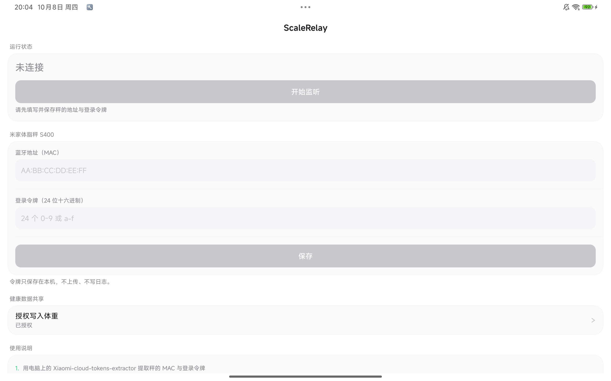

# ScaleRelay

把小米米家体脂秤 **S400** 的体重转发进 Android **健康数据共享（Health Connect）**。

小米自家 App 不会把秤的数据写进 HC，所以从 HC 读体重的应用（比如体重日记）对这台秤永远是空的。
本 App 直连秤、把体重写进 HC，**体重日记一行都不用改**。



## 使用

### 1. 取秤的 MAC 与登录令牌

1. 临时把秤加进「米家」，**并完成至少一次称重**
2. 在电脑上运行 [Xiaomi-cloud-tokens-extractor](https://github.com/PiotrMachowski/Xiaomi-cloud-tokens-extractor)，用同一个小米账号登录
3. 找到 `Mijia Body Composition Scale S400`，抄下 **MAC** 与 **TOKEN**
4. 在米家里**「删除设备」**（不是恢复出厂设置）

> ⚠️ 不要给秤恢复出厂设置、也不要再次加回米家 —— 那会换掉令牌，得重新提取。

### 2. 配置

填 MAC 与令牌 → 保存 → 授权「健康数据共享」的写入体重 → 开始监听。

### 3. 日常

**退出米家** → 赤脚站上秤 → 等读数稳定 → 体重自动进 HC。

> **接入后的第一次称重不会出现在体重日记里，要称第二次才进去。这是设计，不是故障。**
> 体重日记会丢弃「早于它库里最后一条手动记录」的 HC 记录，而它的强制前置步骤要求你先手动记一条 ——
> 边界因此被推到「刚才」。第二次称重落在边界之后，就正常了。

## 隐私

- **没有 `INTERNET` 权限** —— 这个 App 在系统层面就没有联网能力
- 登录令牌只存本机私有目录（`allowBackup=false`，不进云备份），不写日志、不显示
- 只申请 `WRITE_WEIGHT` 一项 HC 权限，**不读取任何健康数据**
- 不收集、不上传

## 已知限制

| 限制 | 说明 |
|---|---|
| **秤不留历史** | S400 只在被踩的那一刻把数据推给当时连着的客户端。**App 没在运行时称的数据拿不回来**（已实测确认，任何第三方 App 都做不到） |
| **必须独占连接** | 米家 App 一开就会抢走秤的连接 |
| **第一次称重进不了体重日记** | 见上文，设计行为 |
| 只写体重 | 不写体脂率等其它指标 |
| 可能违反小米服务条款 | 绕过官方 App 直连设备。风险自担 |

## 构建

```bash
./gradlew assembleDebug     # 调试包
./gradlew distRelease       # 正式包 → dist/ScaleRelay-<版本>.apk（需 keystore.properties）
```

## 它是怎么工作的

S400 **不走 BLE 广播**发测量值（实测抓了 206 个广播，全是只有 MAC 的状态包）。
测量值只通过 **GATT 认证后的加密通道**下发：Mi Home v2 登录（HKDF-SHA256 派生会话密钥 +
双向 HMAC 互验）→ CMTP 分帧 → AES-CCM 解密 → 解析出 ASCII CSV 里的体重。

收到最终测量后**先落盘再写 HC**，写成功才删；失败留队列自动重试 ——
因为秤不留历史，「已到过 App 但没送出去」是唯一能挽救的那类丢失。

## 验证

真机（小米 22081281AC / Android 15 / HyperOS OS2.0）实测通过：

- 自动认证 3 秒、零人工干预
- 前台服务在离开 App + 息屏 30 秒后仍存活
- 写入 HC 后在 HC 界面确认到 `134.5 lb · ScaleRelay`（= 61.0 kg）
- **端到端**：体重日记历史出现「61.0 kg ↓0.5 · 今天 19:31 · 体脂秤」
- 持久化反向验证：撤销 HC 权限 → 称重 → 数据落盘未丢 → 恢复权限 → 自动补写成功

## 许可证

**GPL-3.0**，第三方代码与来源登记见 [NOTICE.md](NOTICE.md)。
对体重日记（MIT）无影响 —— 两者是独立 App、独立包名，只通过 HC 通信。
